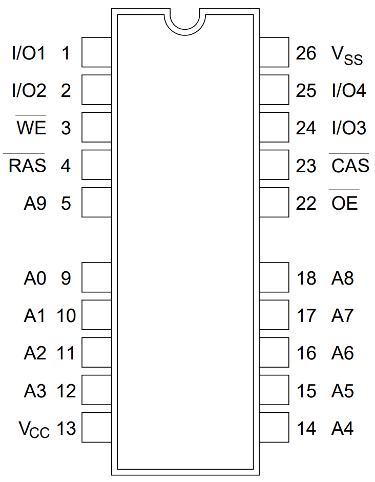

# SupraDrive 500XP 8MB RAM expansion

The SupraDrive 500XP Hard Drive/RAM expansion for the Amiga 500 was available with 512kB, 1MB or 2MB's of RAM but it was expandable to 8MB of DRAM using 16 4x1Mbit DIL memory chips. Those chips were probably already pretty rare back then and they're totally unobtainable today.  
An adapter board was available(?) that made it possible to use 16 ZIP modules instead. I don't know if those modules were cheaper or more available back then but the adapter board probably didn't sell very well and is apparently very rare today, as are the ZIP modules.  
This is why I created this expansion board which can be populated with 16 4x1Mbit 20/26 pin SOJ chips. These chips existed from many manufacturers and can be scavenged from 4MB or 8MB 32-bit FPM SIMM modules which should still be quite easy to obtain.

 

## RAM chips ##

The DRAM chips that are needed for this module are Fast Page Mode (FPM) chips of 1M x 4 bits each (16pcs). The RAM package is SOJ-20.  
It's the kind that has the size of a 26 pin SOJ but are missing three pins in the middle on each side making them 20-pin.

 

They are available from many manufacturers with slight variantions in the part numbers. They typically include numbers like 514400, 414400 or 44400 such as MSM514400, HM514400, HY514400, HYB514400, NN514400, MN414400, AS4C14400, IBM014400, TMS44400  
Other FPM chips with the same specifications should probably work too:
MB814400, GM71C440, MT4C4001J, KM44C1000

The SupraDrive needs RAM with access times below 120ns. I have never seen SOJ FPM chips slower than that and most of them seem to be rated between 60ns and 80ns.

## Soldering ##
SOJ chips are best soldered using stencil and solder paste but I have made the pads extra long so they should be fairly easy to solder by hand too.
Except for the SOJ chips, the only components on the board are 100n 0603 SMD decoupling capacitors and some pin headers. I recommend the flat headers that often are sold at AliExpress and otherplaces as "Stackable Arduino headers" or "stackable female headers". 
Don't worry about the female part as it's only the bottom stacking part that we are interested in. Place the board correctly on top of the sockets and insert the stackable headers through the board and into the sockets and solder on the top side.
The headers are sturdy but flexible and won't kill the sockets. Example: https://www.digikey.com/en/products/detail/adafruit-industries-llc/2830/5823439  
Round machined headers could work too but they are very fragile and easy to break if not properly aligned and there are plenty of pins to align.

## Testing ##
The SupraDrive has a dedicated memory test program on the SupraTools disk called SupraRamTest that works in a special test mode which is activated by setting DIP switch 5 to OFF (down position).  
My experience of SupraRamTest doesn't match the description in the instructions for the program. The instructions say that an 8MB board is tested in 4MB chunks and that it will ask if you want to test the upper 4MB. This doesn't happen for me.  
It also states that a complete pass will take five minutes but it takes much, much longer. On top of this it also identifies the 500XP as a 2MB RAM Card with 8MB of RAM. 
No matter what, I guess it's still very useful for testing the condition of the RAM chips.

I also like to test the memory using the excellent Amiga Test Kit utility by Keir Fraser: https://github.com/keirf/Amiga-Stuff  
This is done in normal memory mode with DIP switch 5 set to ON (up position).

Thanks too my friend Jani over at https://worldofjani.com/ for good discussions and testing. Here are his thoughts about this expansion: https://blog.worldofjani.com/?p=8064

## Various links for SupraDrive 500XP ##
* https://bigbookofamigahardware.com/bboah/product.aspx?id=1246
* https://amiga.resource.cx/exp/supra500xp
* https://blog.worldofjani.com/?p=6808
